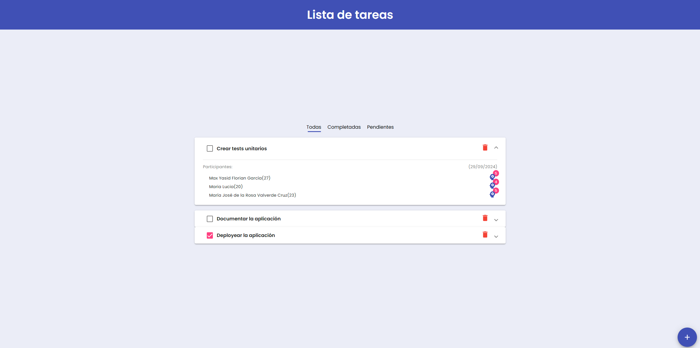

# VelaioInterview

Demo: https://velaio-interview.vercel.app/



## levantar el proyecto en producción (recomendado)

1. Instalar las dependencias:

```
    pnpm i
    o
    npm i
```

2. ejecutar en el directorio del proyecto:

```
    ./node_modules/.bin/ng serve --configuration=production
```

NOTA: La bd tiene 1 minuto de delay al inciar el app.

## levantar el proyecto en local (se requiere el backend)

1. Instalar las dependencias:

```
    pnpm i
    o
    npm i
```

2. ejecutar en el directorio del proyecto:

```
    ./node_modules/.bin/ng serve
```
